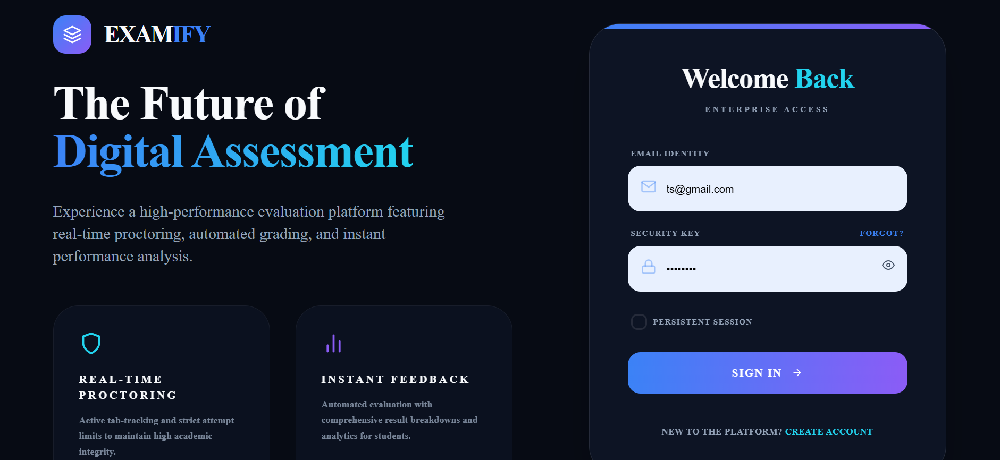
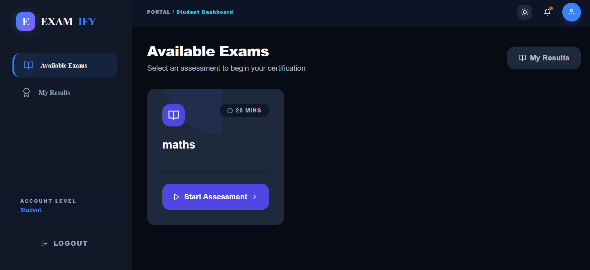

# 🎓 EXMIFY — Online Examination & Assessment Platform

EXMIFY is a modern **full-stack online examination and assessment management system** built with the MERN stack. It provides a complete platform for administrators to create exams, manage questions, evaluate performance, and for users to take assessments, review results, and track progress.

The application follows a scalable architecture with a separated **React frontend** and **Node.js/Express backend**, communicating through RESTful APIs with real-time capabilities using Socket.IO.

---

# 🚀 Features

## 🔐 Authentication & User Management

- Secure user registration and login
- JWT-based authentication
- Password encryption
- Protected routes
- Role-based access control
  - 👑 Administrator
  - 👤 Student/User
- User profile management
- Account preferences

---

# 📝 Examination Management

## Admin Features

Administrators can:

- Create new examinations
- Build and manage questions
- Edit and delete exams
- Manage exam availability
- Monitor performance analytics

## User Features

Users can:

- View available exams
- Take online assessments
- Submit answers
- View scores
- Review completed exams
- Track examination history

---

# 📊 Analytics Dashboard

EXMIFY provides performance insights including:

- Total registered users
- Number of available exams
- Exam participation statistics
- User performance tracking
- Result analytics

---

# 🔔 Real-Time Communication

Powered by **Socket.IO**

Features:

- Real-time notifications
- Instant system updates

---

# 🎨 User Interface

The application provides:

- Responsive design
- Modern dashboard layouts
- Dark/light theme support
- Interactive components
- Context-based state management
- Mobile-friendly experience

---

# 🏗️ System Architecture

```
                    User
                     |
                     |
             React Frontend
          (Vite + Tailwind CSS)
                     |
                     |
              REST API (Axios)
                     |
                     |
            Express.js Backend
                     |
        --------------------------
        |                        |
    MongoDB                 Socket.IO
    Database              Real-time Server
```

---

# 🛠️ Tech Stack

## Frontend

| Technology       | Description              |
| ---------------- | ------------------------ |
| React.js         | User interface framework |
| Vite             | Frontend build tool      |
| Tailwind CSS     | Styling framework        |
| React Router DOM | Client-side routing      |
| Context API      | Global state management  |
| Axios            | HTTP requests            |
| Socket.IO Client | Real-time communication  |

---

## Backend

| Technology | Description             |
| ---------- | ----------------------- |
| Node.js    | JavaScript runtime      |
| Express.js | Backend framework       |
| MongoDB    | NoSQL database          |
| Mongoose   | MongoDB ODM             |
| JWT        | Authentication          |
| bcrypt     | Password hashing        |
| Socket.IO  | Real-time communication |

---

# 📂 Project Structure

```
EXMIFY/
│
├── backend/
│   │
│   ├── config/
│   │   └── db.js
│   │
│   ├── controllers/
│   │   ├── authController.js
│   │   ├── examController.js
│   │   ├── resultController.js
│   │   └── analyticsController.js
│   │
│   ├── middleware/
│   │   └── authMiddleware.js
│   │
│   ├── models/
│   │   ├── User.js
│   │   ├── Exam.js
│   │   └── Result.js
│   │
│   ├── routes/
│   │   ├── authRoutes.js
│   │   ├── examRoutes.js
│   │   ├── resultRoutes.js
│   │   └── analyticsRoutes.js
│   │
│   ├── services/
│   │   └── socketService.js
│   │
│   └── server.js
│
│
└── frontend/
    │
    ├── src/
    │   │
    │   ├── components/
    │   ├── context/
    │   ├── hooks/
    │   ├── pages/
    │   ├── services/
    │   └── utils/
    │
    ├── package.json
    ├── tailwind.config.js
    └── vite.config.js
```

---

# ⚙️ Installation & Setup

## Prerequisites

Make sure you have installed:

- Node.js (v18 or higher)
- npm
- MongoDB Atlas or MongoDB Local

---

# 1️⃣ Clone Repository

```bash
git clone https://github.com/Tsiona23/EXMIFY.git

cd EXMIFY
```

---

# 2️⃣ Backend Setup

Navigate to backend:

```bash
cd backend
```

Install dependencies:

```bash
npm install
```

Create a `.env` file:

```
backend/.env
```

Add:

```env
PORT=5000

MONGO_URI=your_mongodb_connection_string

JWT_SECRET=your_secret_key

NODE_ENV=development
```

Start backend:

```bash
npm start
```

Backend runs on:

```
http://localhost:5000
```

---

# 3️⃣ Frontend Setup

Open another terminal:

```bash
cd frontend
```

Install dependencies:

```bash
npm install
```

Create:

```
frontend/.env
```

Add:

```env
VITE_API_BASE_URL=http://localhost:5000/api
```

Run frontend:

```bash
npm run dev
```

Frontend runs on:

```
http://localhost:5173
```

---

# 🔑 Authentication Flow

```
User Registration
        |
        ↓
Password Hashing
        |
        ↓
JWT Token Generation
        |
        ↓
Protected API Access
        |
        ↓
Role Authorization
```

---

# 📸 Screenshots

## 🔐 Login Page



## 📊 Dashboard



---

# 🌱 Future Improvements

## Artificial Intelligence

- AI-generated questions
- Automatic answer evaluation
- Smart difficulty prediction
- Personalized learning recommendations

## Security

- Email verification
- Password recovery
- Two-factor authentication
- Anti-cheating monitoring

## Cloud & DevOps

- Docker deployment
- CI/CD pipeline
- AWS hosting
- Kubernetes scaling

## Additional Features

- Exam scheduling
- Question randomization
- PDF certificates
- Export reports
- Leaderboards

---

# 👩‍💻 Developer

**Tsion Hailekiros**

Information Technology Student  
Mekelle University

GitHub:
https://github.com/Tsiona23

Portfolio:
https://portfolio-ten-alpha-1p33m5prk6.vercel.app/

---

# ⭐ Support

If you like this project, consider giving it a ⭐ on GitHub.

---

# 📄 License

This project is licensed under the MIT License.
